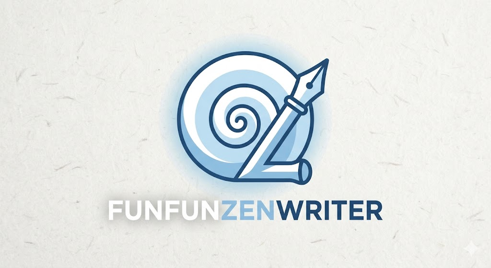

# FunfunZenWriter

A distraction-free Markdown editor for the desktop. Pure white canvas, no toolbars, no clutter — just you and your writing. Built with [Tauri 2](https://tauri.app) (Rust + Svelte).



## Features

- **Distraction-free** — full white canvas, 800px centered text, no toolbars
- **Auto-save** — saves automatically 1 second after you stop typing
- **Live preview** — split-pane Markdown preview, toggled with `Ctrl+Shift+V`
- **Command palette** — `Ctrl+Shift+P` to access all commands with shortcut hints
- **Font picker** — choose font family and size, persisted across sessions
- **Splash window** — full-size branded splash on startup, dismisses automatically
- **AI-ready** — stub backend command wired for future LLM integration
- **Fast** — UTF-8 rope buffer ([ropey](https://crates.io/crates/ropey)) handles large files efficiently

---

## Install

Download the latest release for your platform from the [Releases](../../releases) page:

| Platform | File |
|----------|------|
| Debian / Ubuntu | `FunfunZenWriter_x.x.x_amd64.deb` |
| Fedora / RHEL | `FunfunZenWriter-x.x.x-1.x86_64.rpm` |
| Any Linux | `FunfunZenWriter_x.x.x_amd64.AppImage` |

### Debian / Ubuntu

```bash
sudo dpkg -i FunfunZenWriter_*.deb
```

### RPM (Fedora / RHEL)

```bash
sudo rpm -i FunfunZenWriter-*.rpm
```

### AppImage (any Linux distro)

```bash
chmod +x FunfunZenWriter_*.AppImage
./FunfunZenWriter_*.AppImage
```

---

## Development setup

### Prerequisites

| Tool | Version |
|------|---------|
| Rust | 1.70+ |
| Node.js | 20 LTS |
| System libs | see below |

**Linux system libraries:**

```bash
sudo apt-get install -y \
  libwebkit2gtk-4.1-dev \
  libgtk-3-dev \
  libayatana-appindicator3-dev \
  librsvg2-dev \
  patchelf
```

### Run in development mode

```bash
# Clone the repo
git clone https://github.com/aoqfonseca/funfuneditor.git
cd funfuneditor

# Install JS dependencies
npm install

# Start the app (Vite dev server + Tauri window)
cargo tauri dev
```

### Build a release bundle

```bash
cargo tauri build
```

Artifacts are written to `src-tauri/target/release/bundle/`.

---

## Keyboard shortcuts

| Shortcut | Action |
|----------|--------|
| `Ctrl+Shift+P` | Open command palette |
| `Ctrl+S` | Save current file |
| `Ctrl+O` | Open file |
| `Ctrl+Shift+S` | Save as… |
| `Ctrl+N` | New file |
| `Ctrl+Shift+V` | Toggle Markdown preview |
| `Ctrl+,` | Font & size picker |

---

## Project structure

```
funfuneditor/
├── src-tauri/          # Rust backend (Tauri)
│   ├── src/
│   │   ├── main.rs         # Entry point
│   │   ├── lib.rs          # Tauri builder + command registration
│   │   └── file_manager.rs # File I/O via ropey + AI stub
│   ├── capabilities/
│   │   └── default.json    # Tauri 2 permissions
│   └── tauri.conf.json
├── src/                # Svelte frontend
│   ├── routes/
│   │   ├── +page.svelte        # Main editor page
│   │   └── splash/+page.svelte # Splash screen (own Tauri window)
│   └── lib/
│       ├── Editor.svelte       # Textarea component
│       ├── Preview.svelte      # Markdown preview (marked)
│       ├── CommandPalette.svelte
│       ├── FontSettings.svelte # Font/size picker panel
│       ├── FontLoader.svelte   # Dynamic Google Font injection
│       ├── commands.ts         # Typed Tauri invoke wrappers
│       └── ai_service.ts       # AI integration stub
└── .github/workflows/
    └── release.yml     # CI: build + publish on push to main/master
```

---

## Contributing

Contributions are welcome. Please follow these steps:

1. **Fork** the repository and create a branch from `master`:
   ```bash
   git checkout -b feature/my-feature
   ```

2. **Make your changes.** Keep commits focused — one logical change per commit.

3. **Test locally** before opening a PR:
   ```bash
   cargo tauri dev   # smoke-test in dev mode
   cargo tauri build # verify the release build passes
   ```

4. **Open a pull request** against `master` with a clear description of what changed and why.

### Guidelines

- Rust code: run `cargo clippy` and fix any warnings before submitting
- Svelte/TypeScript: keep components small and focused
- No new dependencies without discussion — keep the binary lean
- The AI integration (`ai_service.ts` / `process_text_with_ai`) is intentionally a stub; PRs adding real LLM backends are very welcome

---

## License

[MIT](LICENSE) © Andre Fonseca
